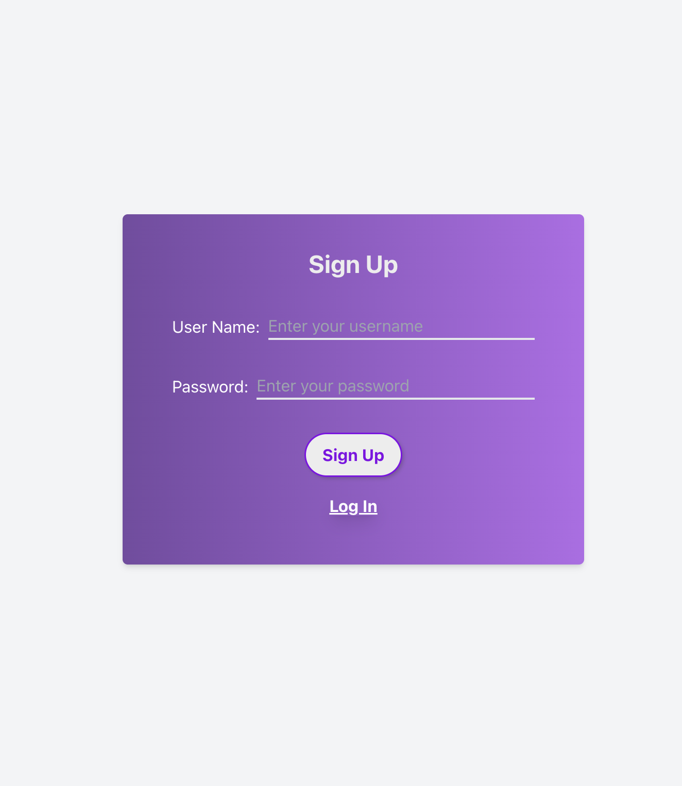
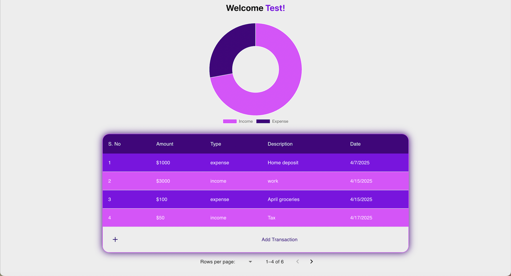

---

# Financial Tracker App

This **Financial Tracker App** allows users to sign up, log in, and track their transactions. It uses **JWT (JSON Web Token)** for secure authentication and **Redux** for managing application state. The app is styled using **Tailwind CSS**.

---

## Features

- 🔑 **User Authentication**: 
  - **Login** and **Signup** functionality using JWT for secure authentication.
  - Users are authenticated via JWT tokens, and the app uses the token for subsequent requests.
  
- 💳 **Transaction Management**:
  - After successful login, users are redirected to the **Transaction** page, where they can manage and track their transactions.
  
- 🧭 **Routing**:
  - **Protected routes**: Users are only allowed to access the **Transaction** page after successful login.
  - Custom error handling for **404 (Page Not Found)** and **500 (Server Error)** pages.

- 🎨 **Tailwind CSS**:
  - The app's UI is styled using Tailwind CSS, which is a utility-first CSS framework.

- 🔄 **State Management with Redux**:
  - Redux is used to manage the authentication state, including storing JWT tokens and user details.

---

## Pages & Routes

| Route           | Component       | Description                                    |
|-----------------|-----------------|------------------------------------------------|
| `/`             | `AuthForm`      | Login page (Login form)                        |
| `/signup`       | `AuthForm`      | Sign Up page (Signup form)                     |
| `/home`         | `Transaction`   | Protected route: Transaction page (requires login) |
| `/serverError`  | `PageNotFound`  | Server error page (500)                        |
| `*`             | `PageNotFound`  | 404 Page Not Found                             |

---

## Screenshots

#### Login Page


#### Sign Up Page



#### Home Page



---

## JWT Authentication

- Upon **Login** or **Sign Up**, a JWT token is generated and returned by the backend.
- This JWT token is stored in the browser's **sessionStorage** and is included in the header of any subsequent API requests to authenticate the user.
- The token is stored using `sessionStorage.setItem("token", token)` and can be accessed whenever needed for authorization checks.

---

## Redux for State Management

The application uses **Redux** to manage global state, especially the authentication state. The `authSlice` contains:
- **User Data**: Stores the logged-in user's username.
- **JWT Token**: Stores the JWT token required for authenticated requests.

Here’s how the state is handled:
- **Login**: When a user successfully logs in, the app dispatches the `login` action to store the token and user data in the Redux store.
- **Error Handling**: Errors related to authentication (invalid credentials, user not found, etc.) are displayed on the form.

---

## Tailwind CSS

Tailwind CSS is used to style the entire application. The app is fully responsive and utilizes utility classes to keep the styling concise.

### How Tailwind CSS is used:
- Custom utility classes for buttons, inputs, and layouts.
- Responsive design to ensure the app is usable on all devices.
- Custom colors and styles to enhance user experience.

---

## How to Run the Application

1. **Clone the repository**:

```bash
git clone https://github.com/yourusername/financial-tracker-app.git
```

2. **Install dependencies**:

```bash
cd financial-tracker-app
npm install
```

3. **Run the app**:

```bash
npm start
```

This will start the development server, and you can open the app in your browser at `http://localhost:3000`.

---

## Project Structure

```
src/
├── components/
│   ├── AuthForm/        # Login & Signup Forms
│   ├── Transaction/     # Transaction Page
│   └── PageNotFound/    # 404 & 500 Error Pages
├── redux/
│   └── slices/
│       └── authSlice.js  # Redux slice for authentication state
├── App.js               # Main App component with routing
├── index.js             # Entry point to the application
├── App.css              # Global styles (Tailwind configurations)
└── index.css            # Tailwind base styles
```

---

## Dependencies

The project uses the following dependencies:

- **React**: The UI library used to build the components.
- **React Router**: For routing and navigation between different pages.
- **Redux**: For state management (authentication state).
- **Axios**: For making API requests.
- **Tailwind CSS**: For styling the components.

### Install dependencies:

```bash
npm install react-router-dom redux react-redux axios tailwindcss
```

---

## Custom Error Pages

- **PageNotFound**: Handles unknown routes (404).
- **ServerError**: Displays a 500 error page for server issues.

---

## License

This project is licensed under the MIT License.

---

### 🛠️ Built With:

- **React** for the front-end UI.
- **Tailwind CSS** for styling.
- **JWT** for authentication.
- **Redux** for state management.

---


